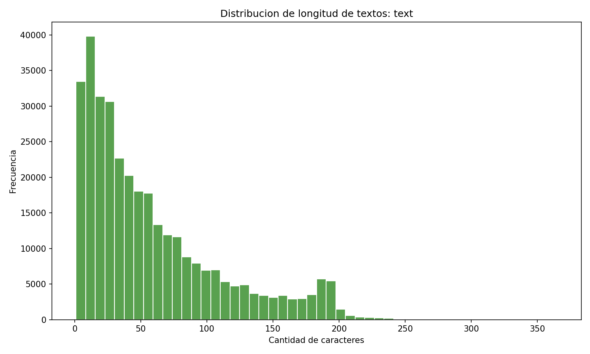
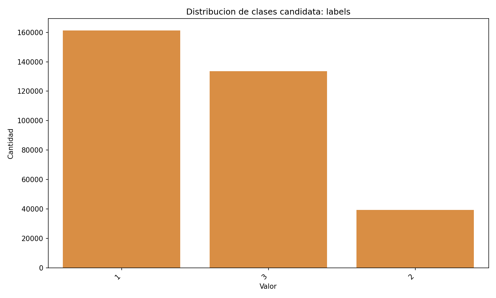
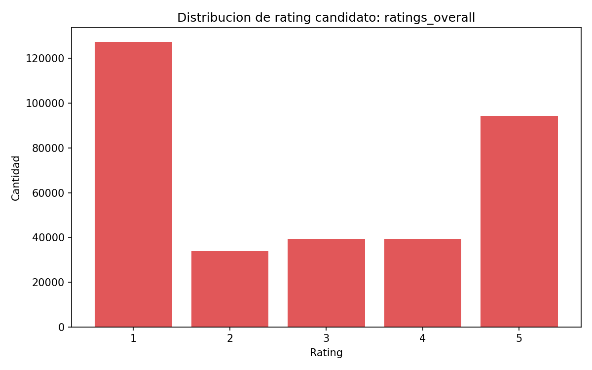
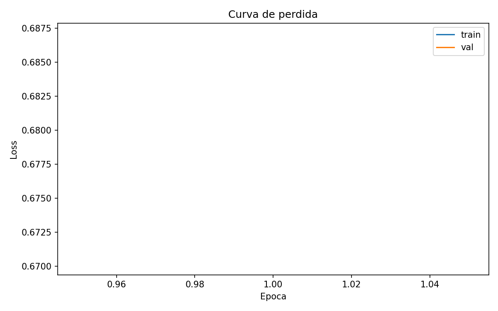
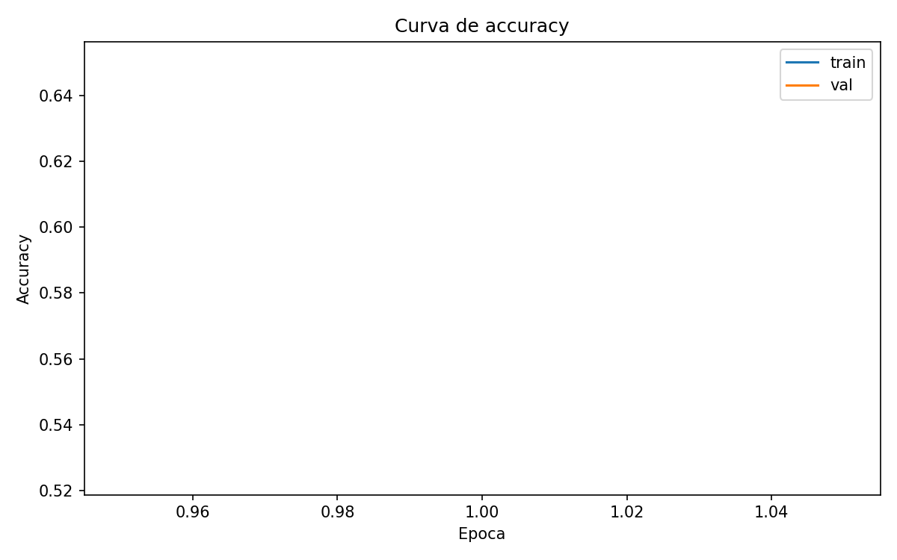
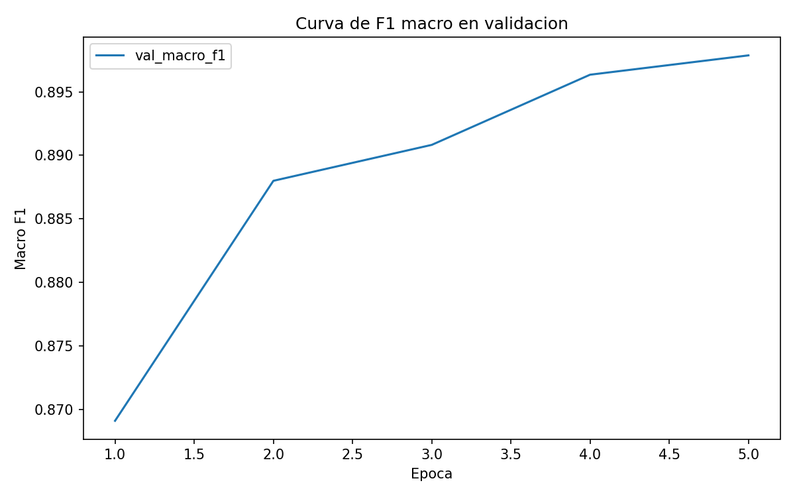
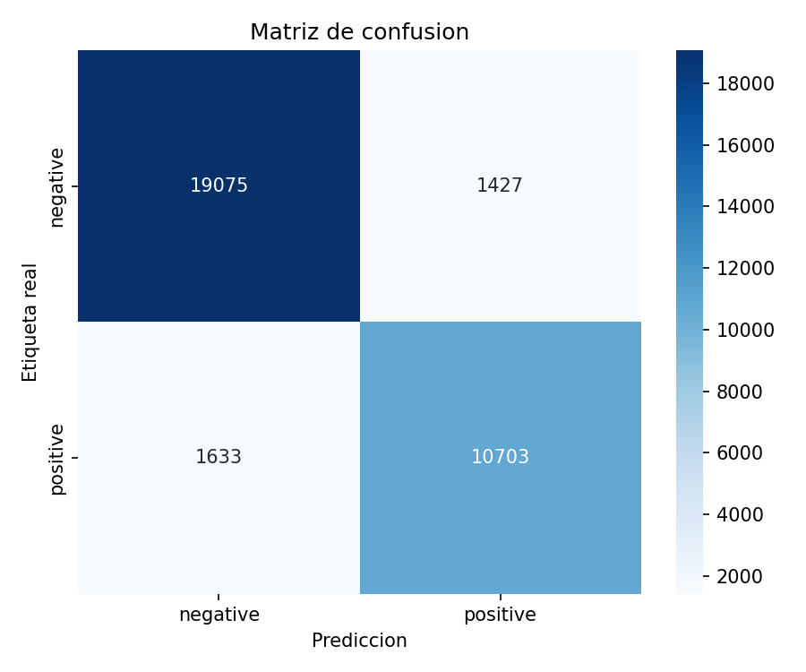
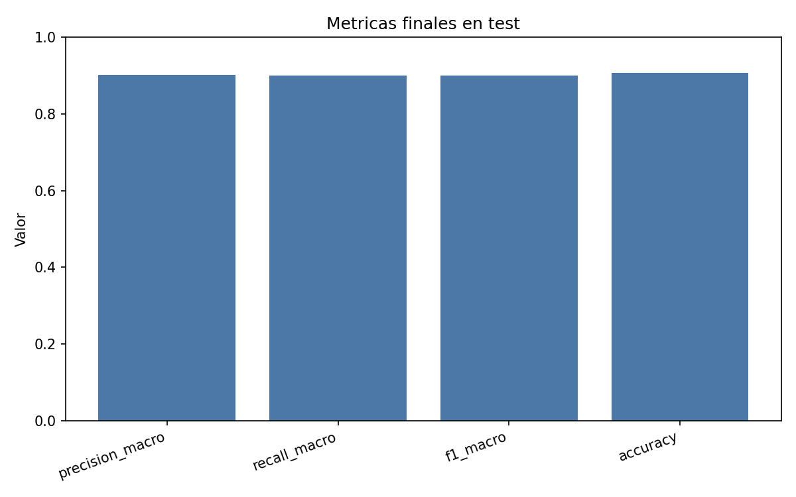

# Mini-GPT para análisis de sentimiento en reseñas de comida

## Portada

- Título: Mini-GPT para análisis de sentimiento en reseñas de comida
- Integrantes: Pablo Garcés Hoyos,
               Alejandra Mejía Patiño,
               Joan Sebastián Sosa Bedoya

- Docente: Robert Erick García Rey

## 1. Introducción

El análisis de sentimiento es una tarea del Procesamiento de Lenguaje Natural orientada a identificar la polaridad expresada en un texto. En aplicaciones reales, esta tarea permite clasificar opiniones, comentarios, reseñas o mensajes de usuarios como favorables o desfavorables. En el contexto de reseñas de comida y restaurantes, el análisis de sentimiento permite resumir la percepción de los usuarios sobre productos, entregas, calidad, sabor, servicio y experiencia general.

Este proyecto implementó un sistema didáctico de análisis de sentimiento basado en una arquitectura reducida tipo GPT. El objetivo no fue construir un modelo generativo de gran escala, sino adaptar los componentes principales de un Transformer tipo decoder a una tarea supervisada de clasificación. Por esa razón, el sistema usa embeddings de tokens, embeddings posicionales, atención causal multi-cabeza, bloques Transformer decoder y una cabeza final de clasificación.

El sistema recibe una reseña o frase corta y predice una de dos clases: `positive` o `negative`. Se utilizó una tarea binaria porque el proyecto busca mostrar de manera clara el flujo completo de un modelo tipo GPT aplicado a clasificación, desde la preparación del dataset hasta la inferencia sobre textos nuevos. Aunque el dataset original contiene una clase neutral, esta fue excluida en la configuración principal para mantener un problema más adecuado a un Mini-GPT académico y de tamaño reducido.

El desarrollo se organizó por fases: análisis exploratorio del dataset, preparación de datos, tokenización, construcción del vocabulario, implementación del modelo, entrenamiento, evaluación final y predicción de frases nuevas. Cada fase generó archivos reproducibles y reportes técnicos que respaldan este informe.

## 2. Dataset utilizado

El dataset utilizado fue **BD Food Review Dataset**, disponible en Kaggle. El archivo analizado dentro del proyecto fue `data/raw/BDFoodSent-334k.csv`. Según el análisis exploratorio, el archivo contiene 334119 filas y 29 columnas. No se detectaron valores nulos ni filas duplicadas exactas en la carga del CSV.

La columna de texto identificada y usada fue `text`. La columna de etiqueta usada fue `labels`, y la columna `ratings_overall` se utilizó como referencia para contrastar la consistencia de las etiquetas. En la preparación de datos se compararon las etiquetas derivadas de `labels` con las derivadas de `ratings_overall`, y se obtuvieron 0 desacuerdos en 334119 casos comparables.

Los textos corresponden a reseñas reales de comida, restaurantes o entregas. En los ejemplos observados predominan textos en inglés o texto normalizado en inglés, aunque también aparecen formas ruidosas, errores ortográficos, expresiones informales y términos asociados al contexto local del dataset. Esto es consistente con datos reales de reseñas de usuarios.

Durante la preparación se configuró una tarea binaria. La clase neutral fue excluida, junto con textos demasiado cortos y duplicados por combinación de texto limpio y sentimiento. La distribución final antes de la división fue:

| Clase | Cantidad |
| --- | ---: |
| negative | 136676 |
| positive | 82239 |
| **Total** | **218915** |

La distribución muestra un desbalance moderado entre clases, con más ejemplos negativos que positivos. Por esta razón, durante el entrenamiento final se usaron pesos de clase. Otros problemas potenciales del dataset incluyen textos muy cortos, ruido propio de reseñas reales, errores ortográficos, dependencia de etiquetas existentes y posibles sesgos de plataforma o contexto cultural.

Figuras exploratorias generadas:







## 3. Metodología

La metodología siguió un flujo incremental y reproducible:

1. Exploración del dataset crudo en `data/raw/`.
2. Identificación de columnas candidatas de texto, etiqueta y rating.
3. Limpieza moderada de textos.
4. Normalización de etiquetas de sentimiento.
5. Filtrado binario para conservar `positive` y `negative`.
6. División estratificada en entrenamiento, validación y prueba.
7. Construcción del vocabulario usando solo `train.csv`.
8. Tokenización con padding, truncamiento y `attention_mask`.
9. Creación de `Dataset` y `DataLoader` de PyTorch.
10. Implementación y entrenamiento del Mini-GPT.
11. Selección del mejor checkpoint con validación.
12. Evaluación final sobre `test.csv`.
13. Predicción de frases nuevas desde consola.

La división final del dataset fue:

| Partición | Filas | negative | positive |
| --- | ---: | ---: | ---: |
| train | 153240 | 95673 | 57567 |
| val | 32837 | 20501 | 12336 |
| test | 32838 | 20502 | 12336 |

La partición `train.csv` se utilizó para ajustar los parámetros del modelo. La partición `val.csv` se utilizó para seleccionar el mejor checkpoint. La partición `test.csv` se reservó exclusivamente para la evaluación final.

La limpieza aplicada fue deliberadamente moderada. Se convirtió el texto a minúsculas, se eliminaron saltos de línea y espacios repetidos, y se conservaron letras, números, puntuación básica y espacios. No se aplicó stemming ni una limpieza agresiva, ya que en análisis de sentimiento la puntuación y ciertas formas expresivas pueden aportar información útil.

## 4. Tokenización y vocabulario

La tokenización se implementó mediante `SimpleTokenizer`, un tokenizador didáctico basado en expresiones regulares. Este tokenizador separa palabras, números y puntuación básica. Por ejemplo, una frase como `The food was delicious` se transforma en tokens como `the`, `food`, `was`, `delicious`, además de los tokens especiales de inicio y fin de secuencia.

El vocabulario se construyó únicamente con `data/processed/train.csv`. Esta decisión evita fuga de información desde validación o prueba hacia el entrenamiento. El vocabulario final tuvo 16612 tokens, con una frecuencia mínima de inclusión de 2.

Los tokens especiales fueron:

| Token | ID | Función |
| --- | ---: | --- |
| `<PAD>` | 0 | Relleno de secuencias cortas |
| `<UNK>` | 1 | Tokens desconocidos |
| `<BOS>` | 2 | Inicio de secuencia |
| `<EOS>` | 3 | Fin de secuencia |

La longitud máxima de contexto fue `MAX_CONTEXT_LENGTH = 128`. Las secuencias más cortas se rellenan con `<PAD>`, y el `attention_mask` marca con 1 los tokens reales y con 0 el padding. Aunque el sistema soporta truncamiento, en el conjunto de entrenamiento ningún texto superó 128 tokens después de la tokenización.

Estadísticas de longitud tokenizada en `train.csv`:

| Métrica | Valor |
| --- | ---: |
| Textos analizados | 153240 |
| Media | 16.0216 |
| Mediana | 13 |
| Mínimo | 5 |
| Máximo | 65 |
| p25 | 8 |
| p75 | 21 |
| p90 | 32 |
| p95 | 37 |
| Textos sobre 128 tokens | 0 |

Estas estadísticas justifican el uso de una ventana de contexto de 128 tokens para este proyecto. La mayoría de reseñas son cortas, lo cual es adecuado para un modelo didáctico de tamaño reducido.

## 5. Arquitectura del Mini-GPT

El modelo implementado es un Mini-GPT adaptado a clasificación de sentimiento. A diferencia de un GPT generativo completo, este modelo no se usa para predecir el siguiente token ni para generar texto. En cambio, procesa la secuencia completa y produce una predicción de clase mediante una cabeza final de clasificación.

Los componentes principales son:

- **Embedding de tokens:** convierte cada identificador de token en un vector denso.
- **Embedding posicional aprendido:** agrega información de posición a cada token.
- **Atención causal multi-cabeza:** permite que cada posición atienda solo a posiciones anteriores o iguales, mediante una máscara triangular.
- **Bloques Transformer decoder:** combinan atención causal, normalización, red feed-forward y conexiones residuales.
- **FeedForward:** red MLP interna de cada bloque Transformer.
- **LayerNorm:** estabiliza las activaciones antes de atención y feed-forward.
- **Conexiones residuales:** facilitan el flujo de gradientes.
- **Dropout:** reduce sobreajuste.
- **Cabeza de clasificación:** transforma la representación final en logits para `negative` y `positive`.

Para adaptar la arquitectura a clasificación, se usa la representación del último token válido de cada secuencia según `attention_mask`. Esto evita usar posiciones de padding como representación final.

Configuración del modelo:

| Hiperparámetro | Valor |
| --- | ---: |
| vocab_size | 16612 |
| max_context_length | 128 |
| embed_dim | 128 |
| num_heads | 4 |
| num_layers | 2 |
| dropout | 0.1 |
| num_classes | 2 |
| pad_token_id | 0 |
| Parámetros totales | 2539778 |
| Parámetros entrenables | 2539778 |

La arquitectura conserva los elementos conceptuales de un Transformer tipo GPT, pero se mantiene pequeña para facilitar su entrenamiento, inspección y explicación académica.

## 6. Entrenamiento

El entrenamiento final se realizó con el dispositivo `mps`. Se usaron 5 épocas, batch size de 32, tasa de aprendizaje de `3e-4`, `weight_decay = 0.01`, `grad_clip = 1.0` y pesos de clase debido al desbalance entre `negative` y `positive`.

El comando usado fue:

```bash
python3 -m src.train \
  --epochs 5 \
  --batch-size 32 \
  --learning-rate 3e-4 \
  --use-class-weights \
  --checkpoint-name mini_gpt_sentiment_best_weighted.pt \
  --last-checkpoint-name mini_gpt_sentiment_last_weighted.pt
```

El criterio de selección del mejor modelo fue `val_macro_f1`, porque esta métrica da el mismo peso a ambas clases y es útil cuando existe desbalance. El mejor checkpoint fue `models/mini_gpt_sentiment_best_weighted.pt`, obtenido en la época 5 con `val_macro_f1 = 0.897870175080072`.

Resultados por época:

| Época | train_loss | train_acc | val_loss | val_acc | val_macro_f1 |
| ---: | ---: | ---: | ---: | ---: | ---: |
| 1 | 0.3670 | 0.8448 | 0.3094 | 0.8750 | 0.8691099925558721 |
| 2 | 0.2921 | 0.8850 | 0.2708 | 0.8951 | 0.8879987774276289 |
| 3 | 0.2690 | 0.8945 | 0.2635 | 0.8970 | 0.8908262341728709 |
| 4 | 0.2544 | 0.9019 | 0.2634 | 0.9027 | 0.896349889493928 |
| 5 | 0.2427 | 0.9065 | 0.2553 | 0.9043 | 0.897870175080072 |

Las curvas de entrenamiento generadas fueron:







La pérdida de entrenamiento disminuyó de forma consistente entre las épocas 1 y 5. La métrica `val_macro_f1` también mejoró progresivamente, lo que indica que el modelo aprendió patrones útiles para distinguir reseñas positivas y negativas.

## 7. Resultados y evaluación

La evaluación final se realizó sobre `data/processed/test.csv`. Esta partición no se utilizó durante el entrenamiento ni durante la selección del checkpoint. Por tanto, sus métricas representan una estimación más adecuada del desempeño final del modelo en datos no vistos.

Resultados finales en test:

| Métrica | Valor |
| --- | ---: |
| Accuracy | 0.906815 |
| Precision macro | 0.901750 |
| Recall macro | 0.899010 |
| F1 macro | 0.900337 |
| F1 weighted | 0.906656 |
| Errores | 3060 |

Métricas por clase:

| Clase | Precision | Recall | F1 | Support |
| --- | ---: | ---: | ---: | ---: |
| negative | 0.921142 | 0.930397 | 0.925746 | 20502 |
| positive | 0.882358 | 0.867623 | 0.874928 | 12336 |

Matriz de confusión:

| Real/Pred | negative | positive |
| --- | ---: | ---: |
| negative | 19075 | 1427 |
| positive | 1633 | 10703 |

La matriz de confusión muestra que el modelo clasificó correctamente 19075 ejemplos negativos y 10703 positivos. Los errores se distribuyeron en 1427 falsos positivos y 1633 falsos negativos. El F1 macro de 0.900337 indica un desempeño sólido considerando el tamaño reducido del modelo y el desbalance de clases.

Figuras finales:





## 8. Predicciones sobre textos nuevos

El sistema final permite clasificar frases nuevas usando el checkpoint entrenado, el tokenizer guardado y el mapeo de etiquetas. Las siguientes predicciones reales fueron obtenidas con `src.predict.py`:

| Texto | Predicción | Confianza | Prob. negative | Prob. positive |
| --- | --- | ---: | ---: | ---: |
| The food was delicious and the service was excellent | positive | 0.9983 | 0.0017 | 0.9983 |
| The food was terrible and the delivery was very late | negative | 0.9931 | 0.9931 | 0.0069 |
| I will order again because everything was perfect | positive | 0.9971 | 0.0029 | 0.9971 |

Estos ejemplos muestran que el sistema cumple el requisito funcional de recibir frases nuevas y devolver una clase de sentimiento. La confianza corresponde a la probabilidad softmax de la clase predicha.

## 9. Análisis de errores y limitaciones

La evaluación final produjo 3060 errores sobre 32838 ejemplos de test. El análisis de errores identificó 1427 falsos positivos, 1633 falsos negativos, 199 errores en textos muy cortos y 1254 errores con alta confianza.

Algunos errores de alta confianza observados en `reports/error_analysis.csv` fueron:

| Texto | Etiqueta real | Predicción | Confianza | Prob. negative | Prob. positive |
| --- | --- | --- | ---: | ---: | ---: |
| excellent thank you | negative | positive | 0.9984 | 0.0016 | 0.9984 |
| very nice food thank you so much | negative | positive | 0.9983 | 0.0017 | 0.9983 |
| very worst service ever day by day food panda delivery person behavior is too worst they dont have dress not ever food warmer box no hygine maintain | positive | negative | 0.9976 | 0.9976 | 0.0024 |

Estos casos sugieren que algunos errores pueden estar asociados a ruido o inconsistencias entre el texto y la etiqueta. Por ejemplo, textos con palabras claramente positivas pueden aparecer etiquetados como negativos, y textos fuertemente negativos pueden aparecer etiquetados como positivos. Esto no implica necesariamente que el modelo falle en comprensión semántica; también puede reflejar problemas de anotación, dependencia de ratings o particularidades del dataset original.

Otras limitaciones importantes son:

- La tarea se redujo a clasificación binaria, excluyendo la clase neutral.
- El tokenizador es didáctico y no utiliza subpalabras, por lo que puede manejar peor palabras raras o errores ortográficos.
- El modelo es pequeño y no fue preentrenado en grandes corpus.
- Las reseñas reales contienen ruido, abreviaturas, errores de escritura, mezcla de idiomas y expresiones informales.
- Frases ambiguas, irónicas o con opiniones mixtas pueden ser difíciles para el modelo.
- El desbalance de clases puede afectar la calibración de probabilidades, aunque se usaron pesos de clase durante el entrenamiento.

## 10. Conclusiones

El proyecto logró construir un flujo completo de análisis de sentimiento con un Mini-GPT didáctico. Se cargó un dataset real, se exploraron sus columnas, se preparó una tarea binaria, se tokenizaron los textos, se construyó un vocabulario solo con entrenamiento, se implementó una arquitectura tipo GPT reducida, se entrenó el modelo, se evaluó sobre test y se habilitó la predicción de frases nuevas.

El desempeño final fue sólido para un modelo pequeño: accuracy de 0.906815 y F1 macro de 0.900337 en test. La diferencia entre F1 macro y F1 weighted muestra la importancia de revisar métricas que consideren el desbalance de clases. El análisis de errores también evidenció que parte de los fallos puede estar relacionada con ruido en las etiquetas o textos de interpretación difícil.

Desde el punto de vista académico, el proyecto permitió estudiar de forma práctica conceptos centrales de NLP moderno: tokenización, vocabulario, embeddings, posiciones, atención causal, bloques Transformer decoder, entrenamiento supervisado y evaluación de clasificación. La adaptación de una arquitectura tipo GPT a clasificación se realizó mediante una cabeza final que usa la representación del último token válido.

Como mejoras futuras se proponen:

- Probar una tarea multiclase que incluya la clase neutral.
- Implementar tokenización por subpalabras.
- Entrenar durante más épocas o ajustar hiperparámetros.
- Comparar con modelos clásicos como regresión logística, SVM o Naive Bayes.
- Evaluar calibración de probabilidades.
- Ampliar el análisis de errores por longitud, tipo de vocabulario o nivel de confianza.
- Revisar manualmente una muestra de etiquetas para estimar ruido de anotación.

## Referencias

Kaggle. (s. f.). *BD Food Review Dataset*. https://www.kaggle.com/datasets/sanjidh090/bd-food-review-dataset

PyTorch. (s. f.). *PyTorch documentation*. https://pytorch.org/docs/stable/index.html

Radford, A., et al. (2018). *Improving language understanding by generative pre-training*. OpenAI. https://cdn.openai.com/research-covers/language-unsupervised/language_understanding_paper.pdf

Raschka, S. (s. f.). *LLMs-from-scratch*. GitHub. https://github.com/rasbt/LLMs-from-scratch

Vaswani, A., et al. (2017). *Attention is all you need*. arXiv. https://arxiv.org/abs/1706.03762

## Anexos

### Comandos principales ejecutados

Exploración del dataset:

```bash
python -m src.explore_data
```

Preparación binaria:

```bash
python -m src.prepare_data
```

Construcción del vocabulario:

```bash
python -m src.build_vocab --max-vocab-size 20000 --min-freq 2 --max-context-length 128
```

Entrenamiento final:

```bash
python3 -m src.train \
  --epochs 5 \
  --batch-size 32 \
  --learning-rate 3e-4 \
  --use-class-weights \
  --checkpoint-name mini_gpt_sentiment_best_weighted.pt \
  --last-checkpoint-name mini_gpt_sentiment_last_weighted.pt
```

Evaluación final:

```bash
python3 -m src.evaluate --checkpoint models/mini_gpt_sentiment_best_weighted.pt
```

Predicción de una frase nueva:

```bash
python3 -m src.predict --text "The food was delicious" --show-probs
```

### Estructura resumida del proyecto

```text
mini-gpt-sentiment/
├── data/
│   ├── raw/
│   └── processed/
├── docs/
├── models/
├── reports/
│   └── figures/
├── src/
│   ├── explore_data.py
│   ├── prepare_data.py
│   ├── tokenizer.py
│   ├── build_vocab.py
│   ├── dataset.py
│   ├── model.py
│   ├── train.py
│   ├── evaluate.py
│   └── predict.py
└── tests/
```

### Archivos generados más importantes

- `reports/dataset_summary.md`
- `reports/preprocessing_summary.md`
- `reports/tokenization_summary.md`
- `reports/training_summary.md`
- `reports/evaluation_summary.md`
- `reports/evaluation_metrics.json`
- `reports/error_analysis.csv`
- `data/processed/train.csv`
- `data/processed/val.csv`
- `data/processed/test.csv`
- `data/processed/tokenizer.json`
- `models/mini_gpt_sentiment_best_weighted.pt`

### Figuras generadas

- `reports/figures/text_length_distribution.png`
- `reports/figures/label_distribution.png`
- `reports/figures/rating_distribution.png`
- `reports/figures/training_loss_curve.png`
- `reports/figures/training_accuracy_curve.png`
- `reports/figures/training_f1_curve.png`
- `reports/figures/confusion_matrix_test.png`
- `reports/figures/final_metrics_barplot.png`

### Pruebas

La suite de pruebas del proyecto finalizó correctamente con:

```text
26 passed
```
